# Hi there, I'm Dedeepya Majety 👋

### Azure Data Engineer | Databricks Platform Engineer | PySpark & Cloud Lakehouse Specialist

 

> **Azure Data Engineer** with **3+ years of experience** at Cognizant building enterprise cloud ETL/ELT pipelines using **Azure Databricks**, **Delta Lake**, **PySpark**, **Azure Data Factory (ADF)**, and **Apache Airflow**.  
> 🟢 **Serving Notice Period** · **Available for Immediate / 30-Day Joining** · **Target Locations: Chennai & Hyderabad, India**

---

### 🚀 Production Highlights & Technical Impact

- ⚡ **Legacy ETL to Lakehouse Migration:** Contributed to the end-to-end modernization of legacy Informatica PowerCenter workflows to **Azure Databricks Delta Lake**, achieving a **40% reduction in average pipeline runtime** and **~30% cloud infrastructure cost savings**.
- 🏛️ **Delta Lake Medallion Architecture:** Engineered scalable **Bronze, Silver, and Gold** data pipelines with automated schema evolution, data quality validation gates, and auditable lineage.
- 🔄 **Continuous Ingestion with Auto Loader:** Ingested multi-source file drops incrementally from ADLS Gen2 using Databricks Auto Loader (`cloudFiles`), eliminating batch ingestion delays.
- ⏱️ **Distributed Workflow Orchestration:** Built modular Python **Apache Airflow DAGs** and **Azure Data Factory (ADF)** pipelines, orchestrating Databricks notebook runs across ADLS Gen2 storage tiers with automated failure recovery.
- 🛡️ **Governance & MDM:** Implemented **Unity Catalog** for centralized fine-grained table and column-level RBAC, and configured **Informatica MDM** match-and-merge rule sets for master golden records.

---

### 🛠️ Technical Stack & Toolchain

| Domain | Technologies & Frameworks |
| :--- | :--- |
| **Big Data & Lakehouse** | Azure Databricks, Delta Lake, Apache Spark, PySpark, Spark SQL, Auto Loader, Unity Catalog |
| **Cloud Storage & Infrastructure** | Azure Data Lake Storage Gen2 (ADLS Gen2), Azure Blob Storage, Azure DevOps |
| **Orchestration & ETL** | Azure Data Factory (ADF), Apache Airflow (Python DAGs), Informatica PowerCenter |
| **Programming & Query** | Python, PySpark, SQL (Spark SQL, Databricks SQL, T-SQL), Shell Scripting |
| **BI & Analytics** | Microsoft Power BI (DAX, Data Modeling, KPI Scorecards) |
| **Master Data & Quality** | Informatica MDM (Match/Merge, Trust Scores, Golden Records), Data Lineage |
| **DevOps & Practices** | Git, GitHub, Azure DevOps CI/CD, Agile / Scrum Methodology |

---

### 🏛️ Delta Lake Medallion Architecture

```mermaid
flowchart LR
    subgraph Bronze [Bronze Tier: Raw Ingestion]
        direction TB
        B1[ADLS Gen2 Source Drop] --> B2[Databricks Auto Loader]
        B2 --> B3[(Bronze Delta Table<br/>Append-only Raw Data)]
    end

    subgraph Silver [Silver Tier: Cleaned & Enriched]
        direction TB
        S1[PySpark Deduplication] --> S2[Schema Enforcement & DQ Rules]
        S2 --> S3[(Silver Delta Table<br/>Conformed Datasets)]
    end

    subgraph Gold [Gold Tier: Business Curated]
        direction TB
        G1[Business Aggregations] --> G2[Star Schema Data Marts]
        G2 --> G3[(Gold Delta Table<br/>Serving Layer)]
    end

    B3 -->|Streaming Micro-batch| S1
    S3 -->|Scheduled Merge / Upsert| G1
    G3 -.->|Direct Lake / Import| PBI[Power BI Dashboards & Ad-hoc SQL]

    classDef bronze fill:#FEF3C7,stroke:#D97706,stroke-width:2px,color:#92400E;
    classDef silver fill:#F1F5F9,stroke:#64748B,stroke-width:2px,color:#334155;
    classDef gold fill:#FEF9C3,stroke:#CA8A04,stroke-width:2px,color:#854D0E;
    classDef serving fill:#E0F2FE,stroke:#0284C7,stroke-width:2px,color:#0369A1;

    class Bronze bronze;
    class Silver silver;
    class Gold gold;
    class PBI serving;
```

---

### 📜 Verified Credentials & Certifications

- 🏅 **Databricks Certified Data Engineer Associate** - Databricks ([Verify Credential](https://credentials.databricks.com/0b153543-bf9a-4130-8d80-0daaffc5a4ea))
- 🏅 **Microsoft Certified: Power BI Data Analyst Associate** - Microsoft ([Verify Credential](https://learn.microsoft.com/api/credentials/share/en-us/DedeepyaMajetyCognizant-8171/5F29A7B356D3AFFB?sharingId=86DC478C83106E9D))
- 🏅 **Microsoft Certified: Power Platform Fundamentals** - Microsoft ([Verify Credential](https://learn.microsoft.com/api/credentials/share/en-us/DedeepyaMajetyCognizant-8171/13F378F1FC820DF?sharingId=86DC478C83106E9D))
- 🏅 **SQL for Data Science** - UC Davis / Coursera
- 🏅 **Data Modeling in Power BI** - Coursera
- 🏅 **Preparing Data for Analysis with Microsoft Excel** - Coursera
- 🏅 **Python Programming** - Industry Certification

---

### 📬 Connect & Opportunity Availability

- 🌐 **Portfolio Website:** [dedeepya-majety-portfolio.vercel.app](https://dedeepya-majety-portfolio.vercel.app)
- 💼 **LinkedIn:** [linkedin.com/in/dedeepya-majety](https://www.linkedin.com/in/dedeepya-majety/)
- 📧 **Direct Email:** [majetydedeepya0@gmail.com](mailto:majetydedeepya0@gmail.com)
- 📍 **Location:** Chennai or Hyderabad, India (Open to Hybrid / Remote)
- ⏱️ **Notice Status:** Serving Notice Period at Cognizant · Immediate / 30-Day Availability
